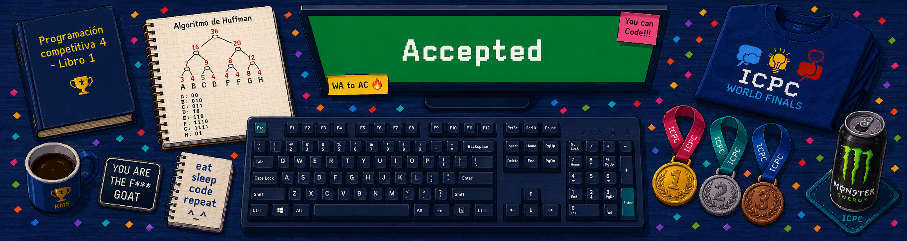

---
hide:
  - navigation
  - toc
---

<section class="home-hero" aria-labelledby="home-title">
  

  
Universidad Católica del Maule · Programación competitiva

  <h1 id="home-title">Aprende, practica y compite</h1>
  
Una guía para desarrollar las técnicas, algoritmos y estructuras de datos que necesitas para resolver problemas de programación competitiva.

  

    <a class="home-button home-button--primary" href="part-01-basic-techniques/">Comenzar a estudiar</a>
    <a class="home-button home-button--secondary" href="00-preface/">Conocer el handbook</a>
  

  
Gracias por visitar este handbook. Esperamos que te acompañe en cada práctica, competencia y nuevo desafío.

</section>
